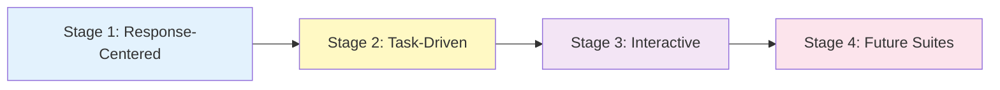

# Interactive Evaluation Requires a Design Science

<div align="center">

[](./Interactive_Evaluation_arxiv.pdf)
[](https://arxiv.org/)
[](https://github.com/yourusername/Interactive_Evaluation/stargazers)
[](LICENSE)

**A Systematic Framework for Evaluating AI Systems that Act Through Trajectories**

[Keyang Xuan](https://keyangxuan.github.io/)¹ · [Peiyang Song](https://peiyangs.github.io/)² · [Pan Lu](https://lupantech.github.io/)⁴ · [Pengrui Han](https://pengruihan.github.io/)⁵ · and others

¹UT Austin · ²Caltech · ³CMU · ⁴Stanford · ⁵UIUC

</div>

---

## 💡 Core Insight

> **As LLMs increasingly act through tools, environments, users, and other agents, evaluation must shift from judging isolated responses to assessing interaction trajectories.**

Traditional benchmarks evaluate **what** a system outputs. Interactive evaluation must also assess **how** it acts, **whether** it recovers from errors, and **what** risks it creates along the way.

## 🎯 The Framework

We define evaluation as an autonomous mapping:

```
E : X → Y
```

Where:
- **X** = Admissible evidence (expands from final responses to **interaction-generated trajectories**)
- **E** = Evaluation program (maps trajectories to judgments about **system-level performance**)

### What Changes in Interactive Evaluation?

| Aspect | Response-Centered | Interactive |
|--------|------------------|-------------|
| **Evidence** | Final answer, label, or text | Trajectories: actions, observations, state transitions, tool calls, user/agent responses |
| **Judgment** | Correctness, similarity, pass/fail | Task success + process quality + recoverability + safety + efficiency |
| **Unit of Assessment** | Single output | System behavior over time |

## 🗺️ 2D Taxonomy of Interactive Evaluation

We propose organizing interactive evaluation along **two orthogonal axes**:

<div align="center">

</div>

### Axis 1: Evaluation Inputs (What trajectories connect to)
- 🛠️ **Tools & Environments** — Web pages, OS, apps, repositories
- 👤 **Users** — Human feedback, clarification, evolving instructions
- 🤝 **Other Agents** — Coordination, negotiation, multi-agent systems
- 🌐 **Hybrid & Dynamic** — Persistent state, cross-session dependencies

### Axis 2: Evaluation Programs (How trajectories → judgments)
- ✅ **Task Success** — Final goal completion
- ⚙️ **Process Quality & Efficiency** — Tool choice, action economy, code locality
- 🔄 **Recoverability & Robustness** — Error detection, plan revision, adaptation
- 🛡️ **Safety, Alignment & Social Competence** — Norm-sensitive behavior, cooperation

👉 **[Explore Interactive Taxonomy Visualization](#)** (Coming Soon)

## 📊 Representative Benchmarks (2016-2026)

We curated and categorized **70+ benchmarks** across three evolutionary stages:

<div align="center">

</div>

### Evolution Stages



- **Stage 1** (20 benchmarks): SQuAD, MMLU, GSM8K, HumanEval...
- **Stage 2** (16 benchmarks): SWE-Bench, GAIA, Mind2Web, ToolBench...
- **Stage 3** (19+ benchmarks): WebArena, OSWorld, Sotopia, AppWorld...

### Key Findings

| Finding | Observation |
|---------|-------------|
| 🎯 **Trajectory evidence remains outcome-centered** | Many benchmarks record trajectories but only score final success |
| 🏗️ **Evaluation programs are substrate-bound** | Metrics follow what's easy to measure, not what claims require |
| ⚠️ **Hybrid & dynamic systems severely underexplored** | Critical gap as systems move toward longer horizons |

👉 **[Browse Full Benchmark Database](./data/benchmarks.json)**

### Quick Stats

```
Total Benchmarks: 70+
Citation Range: 2 - 11,679
GitHub Stars Range: 8 - 39,500
Year Range: 2016 - 2026
```

## 📐 Design Principles

Our framework proposes five core principles for interactive evaluation:

### 1. 📝 Specify the System and Trajectory Evidence
Clarify what system is evaluated, what resources it accesses, and what claims the trajectory supports.

### 2. 🔧 Specify the Interaction Protocol
Document initial state, allowed actions, observation space, stopping rules, reset conditions — the "dataset documentation" of interactive evaluation.

### 3. 🔄 Design for Perturbation and Repair
Test whether systems detect problems, revise strategies, and remain effective under changing conditions.

### 4. 📊 Separate Outcome, Process, and Risk
Report final success, trajectory-level properties (cost, safety, recovery), and risks separately.

### 5. 🏗️ Build Shared Infrastructure Without Freezing Design
Create reusable environments, logging schemas, and reporting templates while preserving diversity in protocols.

## 🎓 Citation

If you find this work useful, please cite:

```bibtex
@article{xuan2025interactive,
  title={Interactive Evaluation Requires a Design Science},
  author={Xuan, Keyang and Song, Peiyang and Lu, Pan and Han, Pengrui and others},
  journal={arXiv preprint arXiv:2XXX.XXXXX},
  year={2025}
}
```

## 🤝 Contributing

We welcome contributions! Help us:
- 🆕 Add new benchmarks to our database
- 🏷️ Improve benchmark categorization
- 📊 Enhance visualizations
- 📖 Expand documentation

See [CONTRIBUTING.md](CONTRIBUTING.md) for guidelines.

## 📬 Contact

For questions or collaborations:
- **Keyang Xuan**: keyangx@utexas.edu
- **Peiyang Song**: psong@caltech.edu

## 📄 License

This project is licensed under the MIT License - see the [LICENSE](LICENSE) file for details.

---

<div align="center">

**[🏠 Project Page](#) · [📄 Paper](./Interactive_Evaluation_arxiv.pdf) · [📊 Data](./data/benchmarks.json) · [🎨 Visualizations](#)**

Made with ❤️ by the Interactive Evaluation team

</div>