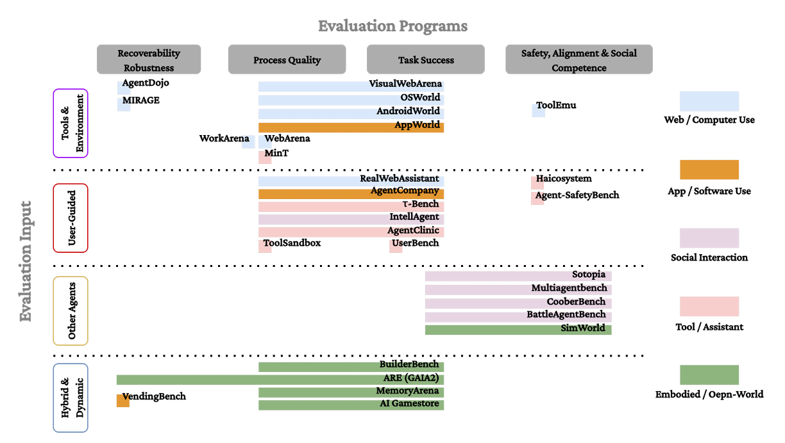

# Interactive Evaluation Requires a Design Science

<div align="center">


[](https://arxiv.org/abs/2605.17829)
[](LICENSE)
[](CONTRIBUTING.md)


</div>


If you find this work useful, please read our [full paper](https://arxiv.org/abs/2605.17829) and/or cite:

```bibtex
@misc{xuan2026interactiveevaluationrequiresdesign,
      title={Interactive Evaluation Requires a Design Science}, 
      author={Keyang Xuan and Peiyang Song and Pan Lu and Pengrui Han and Wenkai Li and Zhenyu Zhang and Zexue He and Wenyue Hua and Manling Li and Jiaxuan You and Adrian Weller and Yizhong Wang and Jiaxin Pei},
      year={2026},
      eprint={2605.17829},
      archivePrefix={arXiv},
      primaryClass={cs.AI},
      url={https://arxiv.org/abs/2605.17829}, 
}
```

---

## 💡 Core Insight

> **Interactive evaluation should be built as a design science for evaluating systems acting through trajectories. The field does not merely need more interactive benchmarks; it needs explicit principles for specifying what interaction artifacts enter evaluation and how an evaluation program maps those artifacts to judgments.**

Response-centered evaluation remains useful when final outputs are sufficient evidence.  
Interactive evaluation becomes necessary when systems act through tools, environments, users, or other agents, so that earlier actions shape later evidence, opportunities, risks, and outcomes.  
The central design question is what trajectory evidence enters evaluation and how that evidence is mapped to system-level judgments.

## 🎯 The Framework

We define evaluation as an autonomous mapping:

```
E : X → Y
```

Where:
- **X** = Admissible evidence (expands from final responses to **interaction-generated trajectories**)
- **E** = Evaluation program (maps trajectories to judgments about **system-level performance**)

### What Changes in Interactive Evaluation?

| Aspect | Response-Centered | Interactive |
|--------|------------------|-------------|
| **Evidence** | Final answer, label, or text | Trajectories: actions, observations, state transitions, tool calls, user/agent responses |
| **Judgment** | Correctness, similarity, pass/fail | Task success + process quality + recoverability + safety + efficiency |
| **Unit of Assessment** | Single output | System behavior over time |

## 🗺️ 2D Taxonomy of Interactive Evaluation

We propose organizing interactive evaluation along **two orthogonal axes**:

<div align="center">

</div>

### Axis 1: Evaluation Inputs (What trajectories connect to)
- 🛠️ **Tools & Environments** — Web pages, OS, apps, repositories
- 👤 **Users** — Human feedback, clarification, evolving instructions
- 🤝 **Other Agents** — Coordination, negotiation, multi-agent systems
- 🌐 **Hybrid & Dynamic** — Persistent state, cross-session dependencies

### Axis 2: Evaluation Programs (How trajectories → judgments)
- ✅ **Task Success** — Final goal completion
- ⚙️ **Process Quality & Efficiency** — Tool choice, action economy, code locality
- 🔄 **Recoverability & Robustness** — Error detection, plan revision, adaptation
- 🛡️ **Safety, Alignment & Social Competence** — Norm-sensitive behavior, cooperation

**Key Findings:**
- 🎯 Trajectory evidence remains outcome-centered — many benchmarks record trajectories but only score final success
- 🏗️ Evaluation programs are substrate-bound — metrics follow what's easy to measure, not what claims require  
- ⚠️ Hybrid & dynamic systems severely underexplored — critical gap as systems move toward longer horizons


## 📐 Design Principles

Our framework proposes five core principles for interactive evaluation:

### 1. 📝 Specify the System and Trajectory Evidence
Clarify what system is evaluated, what resources it accesses, and what claims the trajectory supports.

### 2. 🔧 Specify the Interaction Protocol
Document initial state, allowed actions, observation space, stopping rules, reset conditions — the "dataset documentation" of interactive evaluation.

### 3. 🔄 Design for Perturbation and Repair
Test whether systems detect problems, revise strategies, and remain effective under changing conditions.

### 4. 📊 Separate Outcome, Process, and Risk
Report final success, trajectory-level properties (cost, safety, recovery), and risks separately.

### 5. 🏗️ Build Shared Infrastructure Without Freezing Design
Create reusable environments, logging schemas, and reporting templates while preserving diversity in protocols.

---


## 📊 Representative Benchmarks (Kept Updating)

We curated and categorized **55 benchmarks** across three evolutionary stages:

### Stage 1: Response-Centered 

| Year | Name | Task Type | Paper |
|------|------|-----------|-------|
| 2016 | SQuAD | Reading Comprehension | [Paper](https://arxiv.org/abs/1606.05250) |
| 2018 | GLUE | Reading Comprehension | [Paper](https://arxiv.org/abs/1804.07461) |
| 2019 | DROP | Reading Comprehension | [Paper](https://arxiv.org/abs/1903.00161) |
| 2019 | CommonsenseQA | Commonsense Reasoning | [Paper](https://arxiv.org/abs/1811.00937) |
| 2020 | MMLU | Knowledge & Multitask Reasoning | [Paper](https://arxiv.org/abs/2009.03300) |
| 2021 | GSM8K | Math Reasoning | [Paper](https://arxiv.org/abs/2110.14168) |
| 2021 | MATH | Math Reasoning | [Paper](https://arxiv.org/abs/2103.03874) |
| 2021 | MiniF2F | Formal Theorem Proving | [Paper](https://arxiv.org/abs/2109.00110) |
| 2021 | MBPP | Code Generation | [Paper](https://arxiv.org/abs/2108.07732) |
| 2021 | HumanEval | Code Generation | [Paper](https://arxiv.org/abs/2107.03374) |
| 2022 | Big-Bench | Broad Capability Probing | [Paper](https://arxiv.org/abs/2206.04615) |
| 2022 | TruthfulQA | Truthfulness & Factuality | [Paper](https://arxiv.org/abs/2109.07958) |
| 2023 | LeanDojo | Formal Theorem Proving | [Paper](https://arxiv.org/abs/2306.15626) |
| 2023 | MT-Bench | Human Preference Evaluation | [Paper](https://arxiv.org/abs/2306.05685) |
| 2023 | LongBench | Long-Context Understanding | [Paper](https://arxiv.org/abs/2308.14508) |
| 2024 | Chatbot Arena | Human Preference Evaluation | [Paper](https://arxiv.org/abs/2403.04132) |
| 2024 | LoCoMo | Long-term Memory | [Paper](https://arxiv.org/abs/2402.17753) |
| 2024 | AlpacaEval | Human Preference Evaluation | [Paper](https://arxiv.org/abs/2404.04475) |
| 2024 | Omni-Math | Math Reasoning | [Paper](https://arxiv.org/abs/2410.07985) |
| 2025 | LongMemEval | Long-term Memory | [Paper](https://arxiv.org/abs/2410.10813) |

### Stage 2: Task-Driven 

| Year | Name | Task Type | Paper |
|------|------|-----------|-------|
| 2023 | SWE-Bench | Code & Software Engineering | [Paper](https://arxiv.org/abs/2310.06770) |
| 2023 | API-Bank | Tool Use & API Calling | [Paper](https://arxiv.org/abs/2304.08244) |
| 2023 | Mind2Web | Web Navigation | [Paper](https://arxiv.org/abs/2306.06070) |
| 2023 | GAIA | Tool Use & API Calling | [Paper](https://arxiv.org/abs/2311.12983) |
| 2023 | ToolBench | Tool Use & API Calling | [Paper](https://arxiv.org/abs/2307.16789) |
| 2023 | TaskBench | Task Automation & Planning | [Paper](https://arxiv.org/abs/2311.18760)  |
| 2024 | LiveCodeBench | Code Generation & Execution | [Paper](https://arxiv.org/abs/2403.07974) |
| 2024 | StableToolBench | Tool Use & API Calling | [Paper](https://arxiv.org/abs/2403.07193) |
| 2024 | TravelPlanner | Planning & Constraint Satisfaction | [Paper](https://arxiv.org/abs/2402.01622) |
| 2025 | OSS-Bench | Code & Software Engineering | [Paper](https://arxiv.org/abs/2505.12331) |
| 2025 | MM-BrowseComp | Web Navigation | [Paper](https://arxiv.org/abs/2508.13186) |
| 2025 | BrowseComp | Web Navigation | [Paper](https://arxiv.org/abs/2504.12516) |
| 2026 | DeepPlanning | Planning & Constraint Satisfaction | [Paper](https://arxiv.org/abs/2601.18137) |
| 2026 | Terminal-Bench | Code & Software Engineering | [Paper](https://arxiv.org/abs/2601.11868) |
| 2026 | LongCLI-Bench | Code & Software Engineering | [Paper](https://arxiv.org/abs/2602.14337) |

### Stage 3: Interactive 

| Year | Name | Task Type | Evaluation Input | Paper |
|------|------|-----------|------------------|-------|
| 2024 | AppWorld | App / Software Use | Tools & Environments | [Paper](https://arxiv.org/abs/2407.18506) |
| 2024 | AndroidWorld | Web / Computer Use | Tools & Environments | [Paper](https://arxiv.org/abs/2405.14573) |
| 2024 | τ-bench | Tool / Assistant | Users | [Paper](https://arxiv.org/abs/2406.12045) |
| 2024 | VisualWebArena | Web / Computer Use | Tools & Environments | [Paper](https://arxiv.org/abs/2401.13649) |
| 2024 | OSWorld | Web / Computer Use | Tools & Environments | [Paper](https://arxiv.org/abs/2404.07972) |
| 2024 | AgentDojo | Web / Computer Use | Tools & Environments | [Paper](https://arxiv.org/abs/2406.13352) |
| 2024 | WebArena | Web / Computer Use | Tools & Environments | [Paper](https://arxiv.org/abs/2307.13854) |
| 2024 | Sotopia | Social Interaction | Other Agents | [Paper](https://arxiv.org/abs/2310.11667) |
| 2025 | UserBench | Tool / Assistant | Users | [Paper](https://arxiv.org/abs/2507.22034) |
| 2025 | Agent-SafetyBench | Tool / Assistant | Users | [Paper](https://arxiv.org/abs/2412.14470) |
| 2025 | ToolSandbox | Tool / Assistant | Users | [Paper](https://arxiv.org/abs/2408.04682) |
| 2025 | MultiAgentBench | Social Interaction | Other Agents | [Paper](https://arxiv.org/abs/2406.14340) |
| 2025 | SimWorld | Embodied / Open-World | Hybrid & Dynamic | [Paper](https://arxiv.org/abs/2512.01078) |
| 2025 | ARE (GAIA2) | App / Software Use | Hybrid & Dynamic | [Paper](https://arxiv.org/abs/2509.17158) |
| 2025 | RealWebAssist | Web / Computer Use | Users | [Paper](https://arxiv.org/abs/2504.10445) |
| 2026 | CooperBench | Web / Social Interaction | Other Agents | [Paper](https://arxiv.org/abs/2601.13295) |
| 2026 | BuilderBench | Embodied / Open-World | Hybrid & Dynamic | [Paper](https://arxiv.org/abs/2510.06288) |
| 2026 | MemoryArena | Hybrid / Dynamic | Hybrid & Dynamic | [Paper](https://arxiv.org/abs/2602.16313) |
| 2026 | AI Gamestore | Embodied / Open-World | Hybrid & Dynamic | [Paper](https://arxiv.org/abs/2602.17594) |
| 2026 | VendingBench | Embodied / Open-World | Hybrid & Dynamic | [Paper](https://arxiv.org/abs/2502.15840) |


---

## 🤝 Contributing

We welcome contributions! Help us:
- 🆕 Add new benchmarks to our database
- 🏷️ Improve benchmark categorization
- 📊 Enhance visualizations
- 📖 Expand documentation

See [CONTRIBUTING.md](CONTRIBUTING.md) for guidelines.

## 📬 Contact

For questions or collaborations:
- **Keyang Xuan**: keyangx@utexas.edu
- **Peiyang Song**: psong2@andrew.cmu.edu

## 📄 License

This project is licensed under the MIT License - see the [LICENSE](LICENSE) file for details.

---

<div align="center">

Made with ❤️ by the Interactive Evaluation team

</div>
